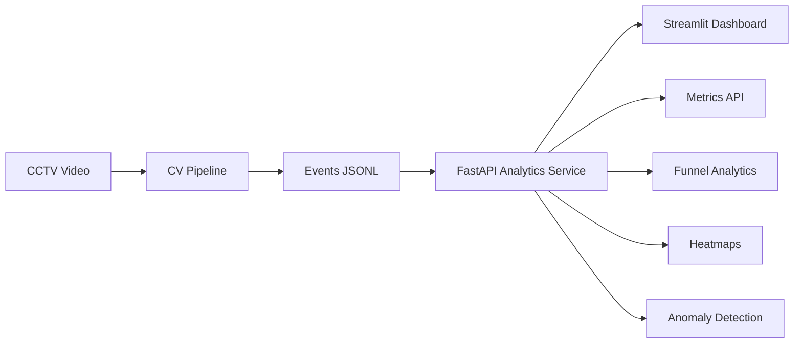

# Store Intelligence

### AI-powered retail analytics from CCTV footage

Store Intelligence transforms raw CCTV video streams into actionable retail insights using computer vision, event processing, and analytics APIs.

---

# Problem

Online businesses have complete visibility into customer journeys, including clicks, sessions, funnels, and conversions. Physical retail stores, however, often lack equivalent analytics despite having CCTV infrastructure already deployed.

This results in limited understanding of visitor behavior, queue formation, dwell patterns, and conversion bottlenecks. Retail managers frequently rely on manual observation rather than data-driven decision making.

Store Intelligence bridges this gap by converting CCTV footage into structured retail analytics.

---

# Solution

The platform provides:

* Person detection using YOLOv8
* Multi-object tracking across video frames
* Visitor session creation
* Entry and exit detection
* Zone movement analysis
* Billing queue monitoring
* Event stream generation (JSONL)
* Analytics API for business metrics
* Conversion funnel reporting
* Heatmap generation
* Anomaly detection

---

# System Architecture



---

# Detection Pipeline

### Computer Vision Layer

* YOLOv8 for person detection
* Multi-object tracking for persistent identities
* Zone assignment using store layout polygons
* Event extraction from tracked trajectories

### Generated Events

* ENTRY
* EXIT
* ZONE_ENTER
* ZONE_EXIT
* ZONE_DWELL
* BILLING_QUEUE_JOIN
* BILLING_QUEUE_ABANDON
* REENTRY

---

# Analytics API

The FastAPI service exposes:

| Endpoint               | Purpose               |
| -----------------------| --------------------- |
| /health                | Service health        |
| /events/ingest         | Event ingestion       |
| /stores/{id}/metrics   | Visitor analytics     |
| /stores/{id}/funnel    | Conversion funnel     |
| /stores/{id}/heatmap   | Zone activity         |
| /stores/{id}/anomalies | Operational anomalies |

---

# Tech Stack

| Layer            | Technology |
| ---------------- | ---------- |
| Detection        | YOLOv8     |
| Tracking         | ByteTrack  |
| Video Processing | OpenCV     |
| API              | FastAPI    |
| Validation       | Pydantic   |
| Database         | SQLite     |
| ORM              | SQLAlchemy |
| Dashboard        | Streamlit  |
| Testing          | Pytest     |
| Containerization | Docker     |
| Language         | Python     |

---

# Project Structure


store-intelligence/
│
├── app/
├── pipeline/
├── scripts/
├── tests/
├── docs/
├── dashboard/
├── data/
├── output/
│
├── README.md
├── requirements.txt
├── Dockerfile
└── docker-compose.yml


---

# How To Run

## 1. Create Virtual Environment

```bash
python -m venv .venv
```

## 2. Activate Environment

Windows:

```powershell
.venv\Scripts\Activate.ps1
```

## 3. Install Dependencies

```bash
pip install -r requirements.txt
```

## 4. Start API

```bash
uvicorn app.main:app --reload
```

## 5. Verify Service

```bash
curl http://localhost:8000/health
```

or

```powershell
Invoke-RestMethod http://localhost:8000/health
```

## 6. Run Detection Pipeline

```bash
python pipeline/detect.py
```

## 7. Ingest Generated Events

```bash
python scripts/ingest_events.py --file output/events.jsonl
```

## 8. Launch Dashboard

**Window 1** — API (must be running):

```powershell
$env:METRICS_REFERENCE_DATE = "2026-03-03T12:00:00Z"
uvicorn app.main:app --reload --port 8000
```

**Window 2** — Streamlit dashboard:

```powershell
pip install streamlit plotly pandas
streamlit run dashboard/app.py
```

Opens at http://localhost:8501 — metrics, funnel, heatmap, and anomalies from the API.

---

# Sample Metrics Response

```json
{
  "store_id": "STORE_BLR_002",
  "unique_visitors": 142,
  "conversion_rate": 0.27,
  "avg_dwell_seconds": 184.6,
  "current_queue_depth": 3,
  "abandonment_rate": 0.08
}
```

---

# Testing

Run all tests:

```bash
pytest -v
```

Coverage:

```bash
pytest --cov=app --cov=pipeline --cov-report=term-missing
```

---

# Limitations

* Staff detection currently uses movement-based heuristics.
* Re-identification accuracy may degrade during severe occlusions.
* Queue estimation is based on visual occupancy.
* Built as a single-store prototype.
* Multi-camera identity fusion is not implemented.

---

# Future Work

* Deep re-identification models
* Cross-camera tracking
* Multi-store deployment
* PostgreSQL analytics backend
* Kafka event streaming
* Real-time dashboards
* Predictive anomaly detection

---

# Author

**Keshav Agarwal**

---
